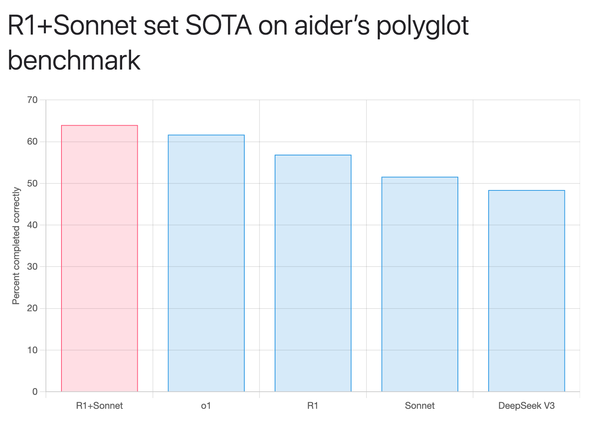

<div align="center">

<h1>DeepClaude 🐬🧠</h1>


Harness the power of DeepSeek R1's reasoning and Claude's creativity and code generation capabilities with a unified API and chat interface.

[](https://github.com/getasterisk/deepclaude/blob/main/LICENSE.md)
[](https://www.rust-lang.org/)
[](https://deepclaude.asterisk.so)

[Getting Started](#getting-started) •
[Features](#features) •
[API Usage](#api-usage) •
[Documentation](#documentation) •
[Self-Hosting](#self-hosting) •
[Contributing](#contributing)

</div>

## Table of Contents
- [Overview](#overview)
- [Features](#features)
- [Why R1 + Claude?](#why-r1--claude)
- [Benchmarks](#benchmarks)
- [Getting Started](#getting-started)
  - [Prerequisites](#prerequisites)
  - [Installation](#installation)
  - [Configuration](#configuration)
- [API Usage](#api-usage)
  - [Basic Example](#basic-example)
  - [Streaming Example](#streaming-example)
- [Configuration Options](#configuration-options)
- [Self-Hosting](#self-hosting)
- [Security](#security)
- [Contributing](#contributing)
- [License](#license)
- [Acknowledgments](#acknowledgments)

## Overview

DeepClaude is a high-performance LLM inference API that combines DeepSeek R1's Chain of Thought (CoT) reasoning capabilities with Anthropic Claude's creative and code generation prowess. It provides a unified interface for leveraging the strengths of both models while maintaining complete control over your API keys and data.

## Features

🚀 **Zero Latency** - Instant responses with R1's CoT followed by Claude's response in a single stream, powered by a high-performance Rust API

🔒 **Private & Secure** - End-to-end security with local API key management. Your data stays private

⚙️ **Highly Configurable** - Customize every aspect of the API and interface to match your needs

🌟 **Open Source** - Free and open-source codebase. Contribute, modify, and deploy as you wish

🤖 **Dual AI Power** - Combine DeepSeek R1's reasoning with Claude's creativity and code generation

🔑 **Managed BYOK API** - Use your own API keys with our managed infrastructure for complete control

## Why R1 + Claude?

DeepSeek R1's CoT trace demonstrates deep reasoning to the point of an LLM experiencing "metacognition" - correcting itself, thinking about edge cases, and performing quasi Monte Carlo Tree Search in natural language.

However, R1 lacks in code generation, creativity, and conversational skills. Claude 3.5 Sonnet excels in these areas, making it the perfect complement. DeepClaude combines both models to provide:

- R1's exceptional reasoning and problem-solving capabilities
- Claude's superior code generation and creativity
- Fast streaming responses in a single API call
- Complete control with your own API keys

## Benchmarks



According to [Aider Polyglot Benchmarks](https://aider.chat/2025/01/24/r1-sonnet.html), the combination of "R1 as architect with Sonnet as editor" has achieved:

- New SOTA of 64.0% on the aider polyglot benchmark
- 14X cost reduction compared to previous SOTA results
- Improved accuracy across multiple programming languages

## Getting Started

### Prerequisites

- Rust 1.75 or higher
- DeepSeek API key
- Anthropic API key

### Installation

1. Clone the repository:
```bash
git clone https://github.com/getasterisk/deepclaude.git
cd deepclaude
```

2. Build the project:
```bash
cargo build --release
```

### Configuration

Create a `config.toml` file in the project root:

```toml
[server]
host = "127.0.0.1"
port = 3000

[pricing]
# Configure pricing settings for usage tracking
```

## API Usage

See [API Docs](https://deepclaude.chat)

### Basic Example

```python
import requests

response = requests.post(
    "http://127.0.0.1:1337/",
    headers={
        "X-DeepSeek-API-Token": "<YOUR_DEEPSEEK_API_KEY>",
        "X-Anthropic-API-Token": "<YOUR_ANTHROPIC_API_KEY>"
    },
    json={
        "messages": [
            {"role": "user", "content": "How many 'r's in the word 'strawberry'?"}
        ]
    }
)

print(response.json())
```

### Streaming Example

```python
import asyncio
import json
import httpx

async def stream_response():
    async with httpx.AsyncClient() as client:
        async with client.stream(
            "POST",
            "http://127.0.0.1:1337/",
            headers={
                "X-DeepSeek-API-Token": "<YOUR_DEEPSEEK_API_KEY>",
                "X-Anthropic-API-Token": "<YOUR_ANTHROPIC_API_KEY>"
            },
            json={
                "stream": True,
                "messages": [
                    {"role": "user", "content": "How many 'r's in the word 'strawberry'?"}
                ]
            }
        ) as response:
            response.raise_for_status()
            async for line in response.aiter_lines():
                if line:
                    if line.startswith('data: '):
                        data = line[6:]
                        try:
                            parsed_data = json.loads(data)
                            if 'content' in parsed_data:
                                content = parsed_data.get('content', '')[0]['text']
                                print(content, end='',flush=True)
                            else:
                                print(data, flush=True)
                        except json.JSONDecodeError:
                            pass

if __name__ == "__main__":
    asyncio.run(stream_response())
```

## Configuration Options

The API supports extensive configuration through the request body:

```json
{
    "stream": false,
    "verbose": false,
    "system": "Optional system prompt",
    "messages": [...],
    "deepseek_config": {
        "headers": {},
        "body": {}
    },
    "anthropic_config": {
        "headers": {},
        "body": {}
    }
}
```

## Self-Hosting

DeepClaude can be self-hosted on your own infrastructure. Follow these steps:

1. Configure environment variables or `config.toml`
2. Build the Docker image or compile from source
3. Deploy to your preferred hosting platform

## Security

- No data storage or logged
- BYOK (Bring Your Own Keys) architecture
- Regular security audits and updates

## Contributing

We welcome contributions! Please see our [Contributing Guidelines](CONTRIBUTING.md) for details on:

- Code of Conduct
- Development process
- Submitting pull requests
- Reporting issues

## License

This project is licensed under the MIT License - see the [LICENSE](LICENSE.md) file for details.

## Acknowledgments

DeepClaude is a free and open-source project by [Asterisk](https://asterisk.so/). Special thanks to:

- DeepSeek for their incredible R1 model
- Anthropic for Claude's capabilities
- The open-source community for their continuous support

---

<div align="center">
Made with ❤️ by <a href="https://asterisk.so">Asterisk</a>
</div>